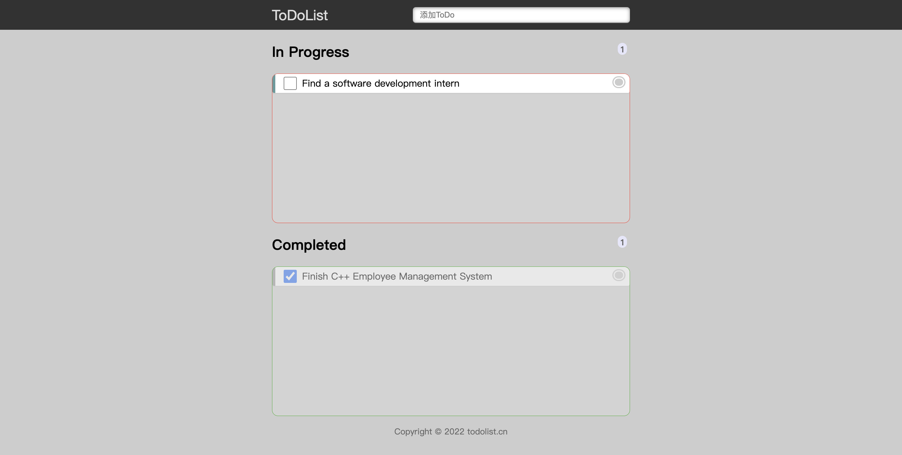

# Task Agenda
Task Agenda is a simple program that allows you to create a list of things to do. If something is done, the user could simply click on the button next to each event to mark it as complete. This process uses jQuery as a assist.

Top portion shows what is to be done, bottom portion shows what is completed. Each box's top right corner shows the number of events currently in the box.

This program stores data into your browser cache, therefore clearing the browser cache will reset the program to default.

Check it out <a href="https://zhengzihao2002.github.io/ToDoList">Here</a>
